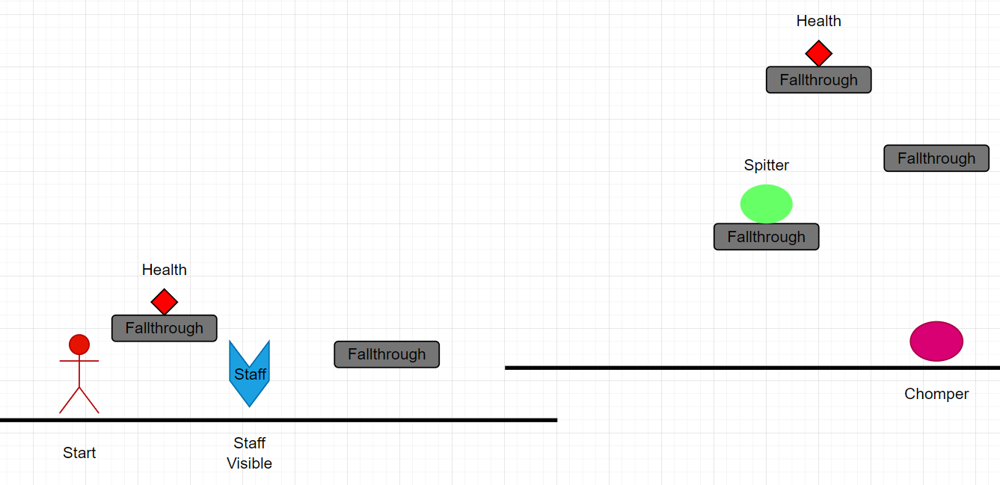
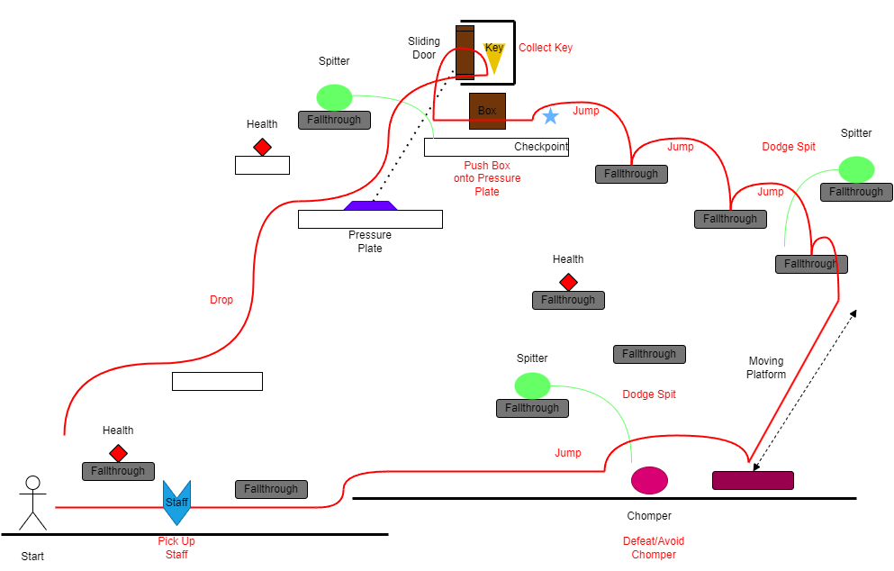

# COMP2150  - Level Design Document
### Name: Alexander Travers
### Student number: 46414843

## 1. Player Experience

### 1.1. Discovery

The player learns a number of concepts throughout the level. 
- The combat utility of the staff and gun, from facing enemies in gradually more difficult positions. 

- The limits of the player character's jumping abilities, through carefully placed platforms just beyond said limits. 

- And, notably, capability of the pushable boxes for puzzle solving in multiple aspects, namely in combination with pressure plates and acid.

The player learns these concepts each in relative isolation before being required to make use of their knowledge, allowing them time to familiarise themselves with and understand it properly before applying it.

### 1.2. Drama

The most readily accessible area of the level is fairly calm, with only a few enemies and light platforming present. 

The next area ramps up, including numerous dangerous crystal spikes as well as providing the player with both a gun and a combat encounter in much tighter quarters.

Once this area is cleared, however, the player exits the cave and is provided with a health box and a key, eliciting a sense of relief, safety, and progression.

From here, the player moves to the final area, a subterrainean acid lake with pushable boxes floating on the surface. The acid, returning the player to their last checkpoint immediately if hit, is a notably more concerning hazard than the crystals. In addition, the boxes bob slightly in the acid, making platforming noticeably more difficult to perform safely. This section also has a relatively low ceiling, leading to much more tense jumps. Once the player has obtained this area's key, they still are not safe. They must also make their way back out the way they came, before being able to relax properly.

Once this section is cleared and escaped, the player is home free, and all tension is relieved.

### 1.3. Challenge

The main challenges in my level are placed in such a manner that the difficulty escalates gradually, but simultaneously does not require the player to engage one kind of challenge for an extended period of time. For example, the level's first notable challenge is engaging a few enemies in simple combat:

But the next difficulty to overcome is one of platforming, to ensure nothing becomes stale. Then a fairly simple puzzle.

Once the key has been retrieved, the next most accessible area contains somewhat more hazardous platforming, and more close quarters enemies:

And once this area is concluded, the final area is the most difficult platforming of the stage, and must be completed twice, but is varied enough internally to (ideally) remain interesting.

### 1.4. Exploration

The level is laid out in a nonlinear fashion, with the entrance to the second and third sections readily visible from the start of the level. It is the intention that seeing these paths will inspire curiosity in the player to investigate them further, and progress through the level in a natural fashion.

Aesthetically, the three areas are distinctly different.
The first section is entirely open-air platforms, floating in the sky. It is intended to feel free, unrestrained, but also precarious.

The second is a rough, craggy cave area entirely enclosed and covered in crystals. It is intended to give a sense of a natural formation, entirely untouched by human hands.

The third is a buried ruin with grass and dirt seeping in, the bricks giving way to nature's reclamation. It is intended to give a sense of abandonment, of peoples long since gone, and the questions raised by their absence.

## 2. Core Gameplay

### 2.1. Weapon Pickup (Staff), Passthrough Platforms, Chompers & Spitters, Health Pickups
  
  
  
  
  
  
  
  
  
I chose to introduce the Staff early so as to allow for enemies to be present throughout the level without the player feeling defenseless. In addition, the enemies here are encountered in a configuration that makes them fairly easy to deal with, suiting their introductory role. Furthermore, the presence of health pickups earlier in the level than the player might need them would encourage curiosity in the player as to what they do, and considering a new player will likely take damage from their first enemy encounter, I believe they will naturally discover the purpose of health kits shortly after. In hindsight, a destructible object between the staff and enemies would be good design, to ensure the player is aware of the function of their new staff before encountering any enemies.

### 2.2. Moving Platforms
  
  
  
  
  
  
  
  
I chose to arrange fallthrough platforms in such a way that there are higher platforms just out of reach without using the moving platform. Therefore, the player will likely attempt to jump from the easily-accessible stationary platforms, fail, and realise the utility of the moving platform as a traversal option.

### 2.3. Keys
  
  
  
  
I chose to place the first key the player will likely encounter behind a simple puzzle, to demonstrate that it is likely an object of value. And, once the player collects said key, the visual feedback from the UI will reinforce this perception and encourage their collection.

### 2.4. Spikes
  
  
  
  
  
The player is introduced to spikes in a very unassuming manner, without any major complications. The jump required to clear the spikes is simply somewhat precise, increasing the likelihood of an unaware player accidentally hitting the spikes and taking damage, therefore becoming educated in their function.

### 2.5. Weapon Pickup (Gun)
  
  
  
  
The player discovers the gun right next to a switch conspicuously out of staff range, and a vertical shaft that is too tall to climb. this will naturally encourage the player to attempt to shoot the switch, which will in turn raise the player up the shaft.

### 2.6. Checkpoints & Acid
  
  
  
  
  
  
  
  
  
(The player encounters Checkpoints at other places throughout the level, but this point is where they are most likely to first be of major use.)
The use of a moving platform in this encounter amplifies the likelihood that a player will fail to pass this challenge on their first attempt. Therefore, they are likely to experience acid's "one-hit respawn" properties, which make it far more effective in slowing progress than spikes. In addition, as respawning places the player at a checkpoint, they will now be informed as to the function of said checkpoints, should they not have gleaned it elsewhere.

## 3. Spatiotemporal Design
 
### 3.1. Molecule Diagram
  

### 3.2. Level Map – Section 1
  

### 3.3.	Level Map – Section 2
  

### 3.4.	Level Map – Section 3
  

## 4. Iterative Design (~400 words)
Reflect on how iterative design helped to improve your level. Additional prototypes and design artefacts should be included to demonstrate that you followed an iterative design process (e.g. pictures of paper prototypes, early grey-boxed maps, additional storyboards of later gameplay sequences, etc.). You can also use this section to justify design changes made in Unity after you drew your level design maps shown in section 3. 

You should conclude by highlighting a specific example of an encounter, or another aspect of your level design, that could be improved through further iterative design.

Iterative design helped to improve my level via the streamlining and re-evaluation of the placement of multiple main level elements. The earliest prototype design I have for the level as a whole can be seen below, with an attached key for what any given colour represents.

  
  

There are numerous minor changes from this intended design in the final level, mainly in the form of decisions that will ensure the player has a smooth flow through the level (Using bridges to close off areas that are not intended to be traversed yet, preventing the player from pushing a box off the platform it is intended to remain on, etc.) A good example of this is in the upper exit from area 2's cave. In the preliminary prototype, it was possible to drop to the acid lake from here, sending the player back to the mid-area-2 checkpoint, and likely frustrating them greatly. This flaw remained until the level was greyboxed, at which point it became apparent and was corrected.

Additionally, playtesting early greyboxed versions of the level, (included below) revealed a number of additional minor flaws:
- Platforms were placed in such a way that intended encounters could be skipped.
- Ceiling tiles were too low in multiple cases, leading to unintentionally difficult platforming.
- Spike hitboxes were poorly oriented, leading to the player taking damage when it felt unwarranted.

  
  
  

One particular aspect I believe could be improved through further iterative design is the introduction of the weapons. In both cases, they are introduced to the player, and shortly afterwards the player is expected to use them in combat with little practice. A smoother introduction, likely with some puzzles requiring use of the weapons, such as destructible pillars and shootable switches, would feel less jarring for the player, and improve the sense of flow throughout the stage.